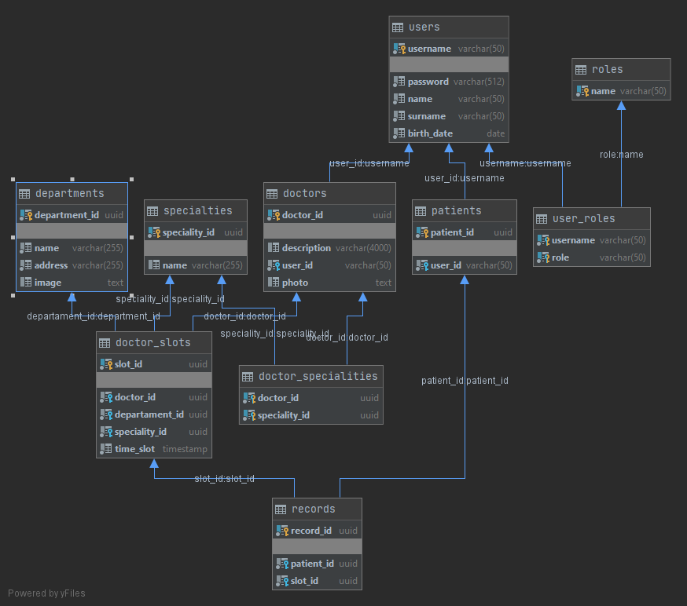

# Регистратура

WEB Сервис для записи пациентов к врачам и просмотр записей врачами. Возможность для пациента записатся к 
 соотвествующему врачу в доступном отделении и в соотвествующие свободное время. Для врача доступ просмотр всех
  пациентов клиники.  

   
    
    Приложение разворачивается через контейнер Docker Desktop, при проблеме запуска через Intellij 
    запустить через консоль сначала собрать jar файл, затем запустить сборщик docker-compose up --build -d
    
    Данные для входа
        1. Пациент
            a. Логин - Allushka
            b. Пароль - Topor789
            
        2. Доктор
            a. Логин - FOX
            b. Пароль - Qwerty

Страницы 

    1. Авторизация - для всех.
        a. Валидация значений:
            - Несуществующего пользователя.
            - Неверного пароля.
        b. При успешном вводе, переход на страницу записей, для каждой роли своя.
         
    2. Регистрация - для всех.
        a. Валидация значений:
            - Соответствие паролей.
            - Все поля обязательны для заполнения.
            - Пароль не менее 6 символов.
            - Логин не менее 5 символов.
            - Уникальность логина.
        b. При успешной регистрации создание нового пользователя и переход на страницу авторизации.
        
    3. Просмотр своих записей - для пациентов.
        a. Список прошедших и будущих записей. Предусмотренна пагинация.
        b. Возможность создать запись. Реализация через модальное окно (через асинхронный ajax-запрос):
            - Выбор специализации врача.
            - Выбор доступного отделения (по специализации врача).
            - Выбор доступного времени соотвествующего врача (по специальности и отделению).
            - При успешной записи, происходит добавление записи в таблицу.
        c. Переход на страницу Контактов.
        d. Переход на страницу докторов.
        e. Выход из сессии. Рядом указан логин пользователя.
    
    4. Просмотр своих записей (к себе) - для врачей
        a. Список прошедших и будущих записей. Предусмотренна пагинация.
        b. Переход на страницу Контактов.
        c. Переход на страницу докторов.
        d. Выход из сессии. Рядом указан логин пользователя.
    
    5. Контакаты - для всех
        a. Список отделений с их описанием.
        b. Переход на страницу записей.
        c. Переход на страницу докторов.
        d. Выход из сессии. Рядом указан логин пользователя.
    
    6. Врачи - для всех
        a. Список врачей с их описанием.
        b. Переход на страницу контактов.
        c. Переход на страницу записей.
        d. Выход из сессии. Рядом указан логин пользователя.
        
    7. Пациенты - для врачей
        a. Список всех пациентов
        b. Переход на страницу контактов.
        c. Переход на страницу записей.
        d. Выход из сессии. Рядом указан логин пользователя.
  